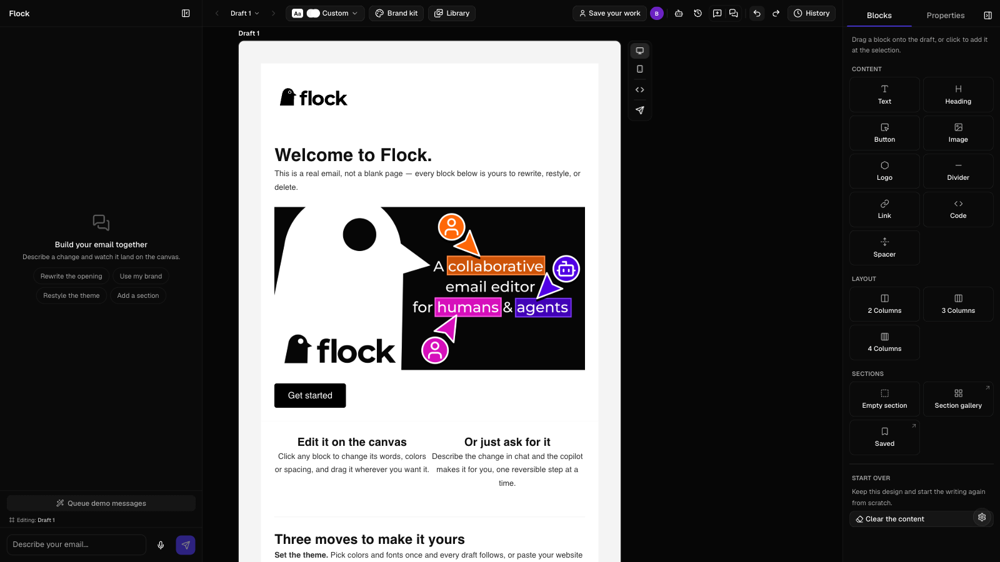
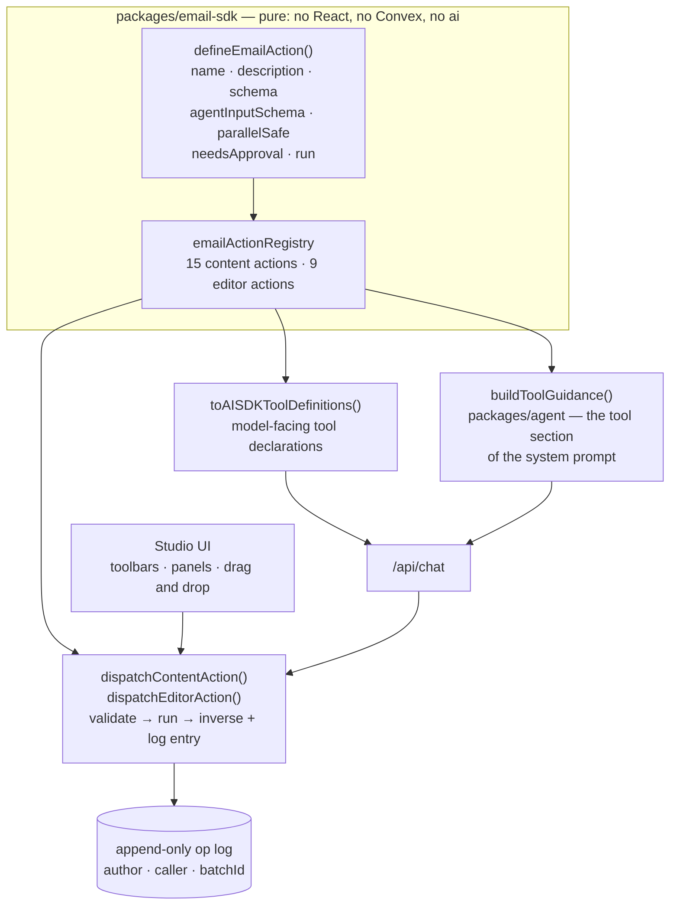
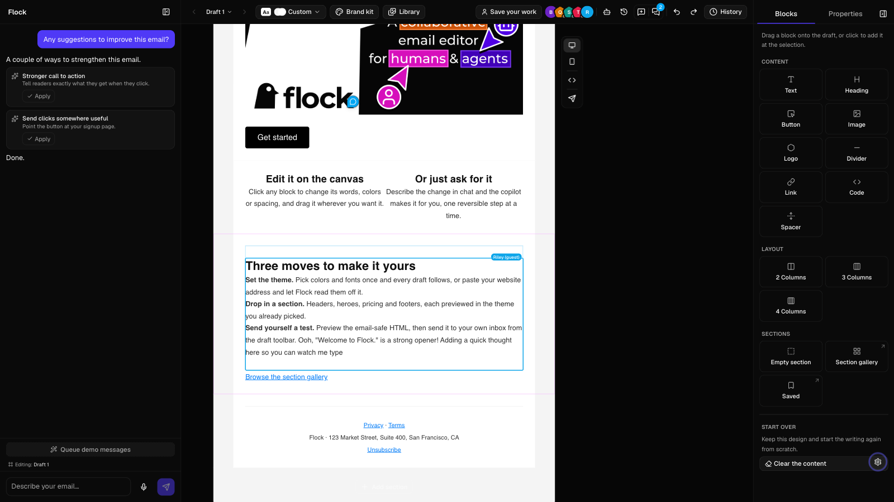
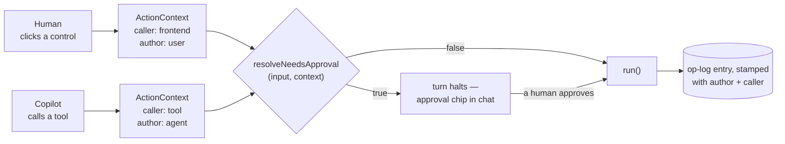
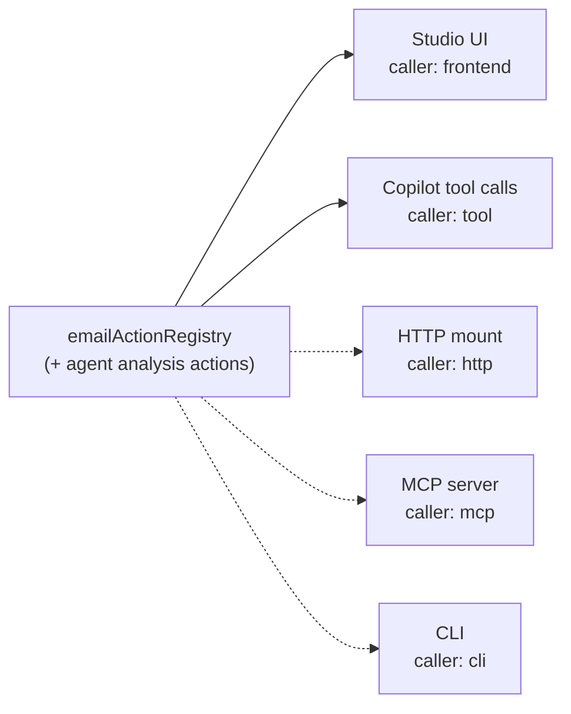
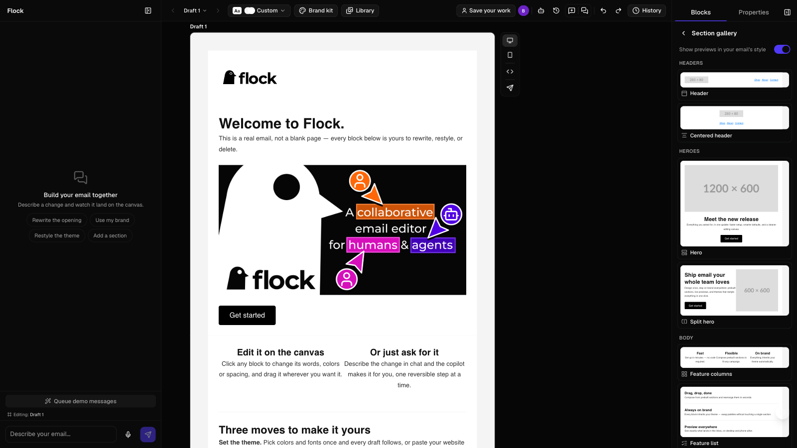
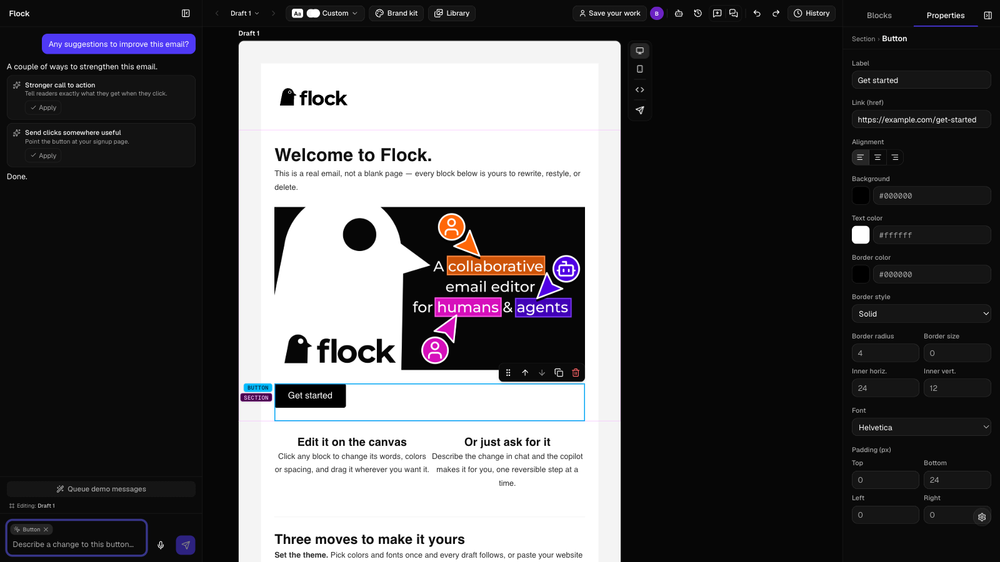
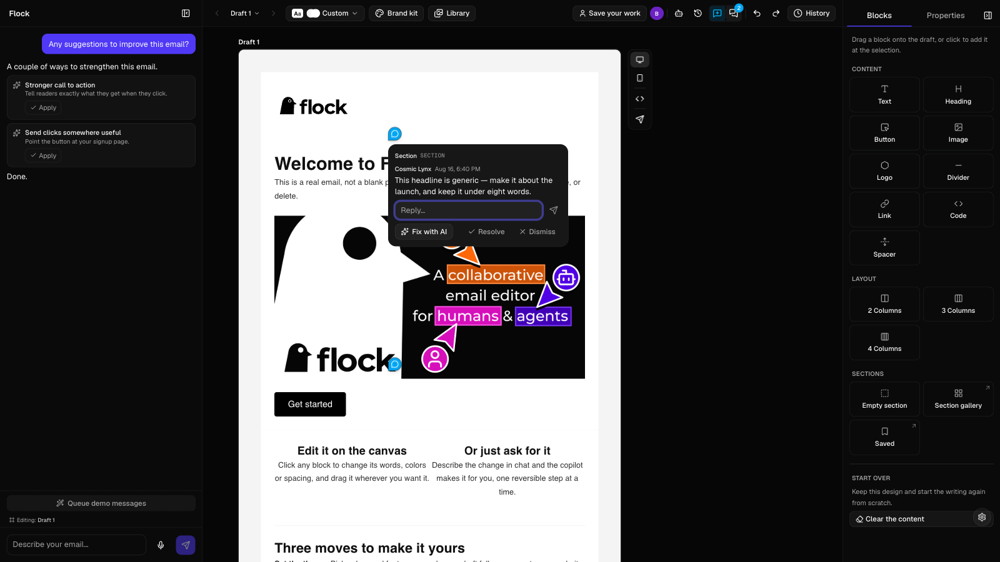
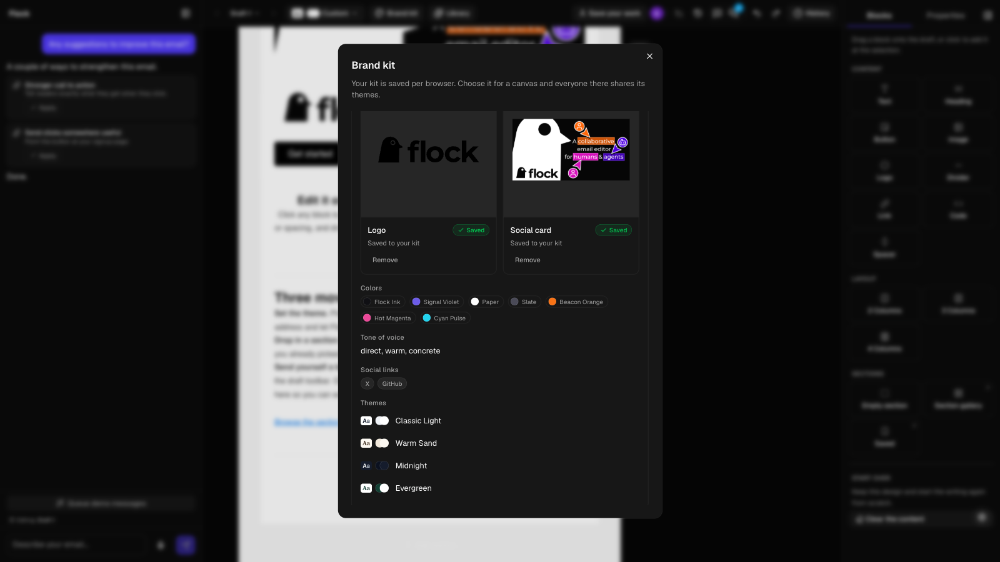

# Flock

**What email creation looks like when humans and agents are the same kind of collaborator.**

<!--
  SCREENSHOT CAPTURE PLAN — notes for the owner, who takes these by hand.
  Invisible when rendered. Nothing below changes a single visible character.

  SHARED CONDITIONS, true of every capture in this file. The six existing shots
  already obey them; matching them is what keeps the README visually consistent.

  · SIZE: 1600 × 900 exactly (16:9). Every file in assets/screenshots is this.
  · THEME: dark, throughout. App chrome only — settings FAB (bottom right) →
    Appearance → Dark, or ⇧⌘L to cycle. The email document keeps its own
    author-chosen colors in either mode, so this only moves the studio's chrome.
  · URL: http://localhost:3000 ONLY. Any other port, or 127.0.0.1, or a LAN IP,
    makes every auth route 403 with "Invalid origin". Run `pnpm dev` from the repo
    root and make sure it did not fall through to :3001 because 3000 was taken.
  · THE ONBOARDING TOUR WILL PHOTOBOMB YOU. It auto-starts for a first-time
    visitor and its card sits over the studio. Let it run to the end or dismiss it
    before framing anything. Progress lives in localStorage under
    `flock:tour-progress`; clearing that key brings the tour back, and settings FAB
    → "Show me around" restarts it deliberately. Check every frame for the card.
  · NO REAL PERSONAL DATA: no genuine email addresses and no real account names —
    in the presence facepile, the drafts bar, the send-test dialog, or a URL field.
  · Suppress the Next.js dev-tools badge if it is visible. It owns the exact
    bottom-right corner during `next dev` (the settings FAB is deliberately raised
    above it, which is why both can end up in the same corner of a frame).
  · Note the panel keys, used repeatedly below: ⌘B toggles the chat panel, ⌘\
    toggles the right rail (blocks & properties), `C` toggles comment mode.

  STATUS KEY used per image: KEEP AS IS = current and clean, do not redo it.
  RE-SHOOT = stale or carrying chrome it should not have; the reason is stated.

  OUT OF SCOPE: the two files in the Demo table below
  (apps/web/public/screenshots/flock-app-{dark,light}-mode.png) are a separate
  light/dark pair at a different size and are not part of this plan.
-->

<!--
  studio-hero.png — RE-SHOOT.

  REASON: Demo mode was on when this was taken, so the chat panel carries a
  "Queue demo messages" button. That is a real labelled feature, not a debug
  artifact, but it is chrome that should not be in the very first frame a reader
  sees. Nothing else is wrong with the shot.

  MUST BE VISIBLE: the studio doing its ordinary job, because this frame is
  carrying the "you get a room" claim in the paragraph below it. Canvas with a
  draft open and a real-looking email on it (the polished starter Welcome email a
  new draft opens on is exactly right), the drafts bar, the toolbar, and the chat
  panel EXPANDED on the right with the prompt-starter chips above the composer. A
  second draft beside the active one reads as a room; one lonely frame does not.

  HOW TO GET THERE: settings FAB → uncheck "Demo mode" FIRST, then confirm the
  "Queue demo messages" button has gone from above the composer. Appearance →
  Dark. Open /studio, finish or dismiss the tour, then ⌘B to expand the chat panel
  — it defaults COLLAPSED to a 48px rail on a first visit (panel-preferences.ts),
  and the composer is still mounted inside that rail, so "the chips are missing"
  is the symptom to watch for. Duplicate the draft once from the drafts bar to get
  the sibling frame rendering as a live preview.

  MUST NOT BE IN FRAME: the "Queue demo messages" button, the tour card, the op
  inspector or time-travel replay toolbar buttons (both hidden by default — leave
  them off, they are power-user chrome), any real email address, an empty canvas.
-->



*The UI is changing quickly. Every screenshot in this README is a snapshot of a moving target — treat them as a sense of the shape, not a specification. Nothing else in this document is approximate: every capability claimed below is in the repo, and everything that is not built yet is in [its own section](#planned--not-built-yet).*

Flock is a collaborative email studio where you don't just get an AI assistant bolted onto an editor — you get a room. You edit on a live canvas; a copilot builds alongside you from plain language; a crew of advisory agents reads your drafts on a cadence and leaves reviewable recommendations; and other humans (and their agents) can be in the document at the same time, cursors and all. Every change — human click, copilot edit, agent suggestion — flows through the same validated, invertible operations, so you can see who did what, apply anything with one click, and revert anything just as fast.

The argument this project is making: **an agent should get the same capabilities as a human, and no more authority.** Not a reduced set of capabilities, not a parallel and weaker one — the same one, generated from the same source. And separately, deliberately, less authority: the things that are irreversible or that leave the building stay behind a human's decision.

### 🎥 Demo

**[Try the live demo →](https://flockto.email/demo)** — a scripted walkthrough you can drive yourself. It seeds a real email, puts two advisory agents on the canvas reviewing it, and walks you through three steps: watch them work, accept or dismiss their recommendations, then leave a comment and watch one get answered. No account, no setup. Every model call on that route is served from a deterministic fixture, so nothing you do there spends anyone's quota — everything downstream of the model is the real product.

Prefer to watch? [View the recorded demo](https://drive.google.com/file/d/1wFisUqoCZpDKZrtSQlJ2VxGkeRBH4PZB/view?usp=drive_link).

| Dark | Light |
|--------|-------|
|  |  |

## The actions layer

Most products that add an AI assistant end up maintaining two descriptions of what the product can do: the real one, in the UI code, and a second one written for the model — a set of tool definitions, hand-written, drifting. The second one is always a subset, always slightly wrong, and always the thing you forget to update.

Flock has one. `packages/email-sdk/src/actions/` holds a registry of **actions**. An action is a single, self-describing unit of "a thing that can be done to an email", defined once:

```ts
export const sendTestEmailAction = defineEmailAction({
  name: "sendTestEmail",
  description:
    "Send a test version of the current email to one recipient for review. Requires human approval before executing.",
  kind: "editor",
  schema: sendTestEmailInputSchema,
  readOnly: false,
  parallelSafe: false,
  needsApproval: true,
  run: (input): SendTestEmailCommand => ({ type: "sendTestEmail", to: input.to }),
});
```

That one definition carries everything any consumer needs: the name, the human- and model-facing description, the full Zod schema that validates every invocation, a compact model-facing variant of that schema, whether it is safe to run concurrently, and whether a human has to approve it. There is no second place to update.



Read the arrows out of `emailActionRegistry`. Three different things are **generated** from it, none of them written by hand:

- **`toAISDKToolDefinitions(registry)`** produces the tool declarations the model is given. Adding an action to the registry is the entire act of giving the copilot a new capability.
- **`buildToolGuidance(registry)`** — in `packages/agent/src/prompts/` — writes the "Available tools" section of the system prompt by walking the same registry, printing each action's own `description` alongside its `kind`, `readOnly`, `parallelSafe`, and `needsApproval` flags. The prompt cannot describe a tool the registry does not have, or omit one it does.
- **`dispatchContentAction` / `dispatchEditorAction`** are the execution path, and they are the *same* execution path for both callers. The studio's own editor store dispatches human edits through `dispatchContentAction` against `emailActionRegistry`; the chat pipeline dispatches the model's tool calls through the same function, against a registry that is the same one plus a few read-only analysis tools.

There is no "AI path" through this codebase. There is one path, taken by two kinds of caller.

### The consequences

**Validation is not something the model can skip.** The compact `agentInputSchema` is what the model *sees*; dispatch always re-validates the raw input against the full `schema`. A malformed tool call is rejected before the document is touched, and the rejection is written as a repair hint — the errors carry a stop-vs-retry taxonomy so a fixable mistake costs one round-trip and an unfixable one ends the turn honestly instead of thrashing.

**Intent is translated deterministically, and only the result is recorded.** Some actions take model-friendly intent rather than document surgery: `styleTextSpan` takes "the phrase to find and how to style it", `scaffoldSection` takes a catalog template id and its copy. A pure `resolveOperation` hook turns that intent into one canonical operation against the current document *before* anything runs — so the history spine only ever holds replayable operations, never intent shapes, and undo works on them like everything else.

**Provenance is structural.** Every dispatch carries an `ActionContext`: who the author is, whether they are a `user` or an `agent`, which surface the call arrived through, and which batch it belongs to. That context is stamped onto the op-log entry. "Who changed this, and was it a human or an agent?" is answerable because it is recorded at the only place a change can happen.

**Concurrency is declared, not guessed.** `parallelSafe` is a per-action fact with a written rationale. Single-block property and text edits are parallel-safe; anything that contends on the document root's globals, or shifts sibling indices, is not. The model is told which is which, in the tool guidance, generated from the flags themselves.

## Same capabilities, different authority

The symmetry is the point, and so is the asymmetry.

<!--
  multi-agent-canvas.png — RE-SHOOT, but read the caveat before spending time.

  REASON: the ghost collaborator typed visible demo filler into the email body —
  'Ooh, "Welcome to Flock." is a strong opener! Adding a quick thought here so you
  can watch me type'. The collaboration itself is authentic (real presence, a real
  cursor, real sync through the same pipeline as a human's keystrokes), but the
  copy announces itself as a demo from inside the product screenshot.

  CAVEAT — THE GHOST'S SCRIPT IS NOT CONTROLLABLE FROM THE UI. It is composed
  server-side by composeGhostScript() in convex/ghost.ts and that sentence is
  hard-coded. Three ways out, cheapest first:
    1. SHOOT EARLY. The ghost types character by character over a bounded ~25s
       run, so there is a window of several seconds where only the opener has
       landed and "Adding a quick thought here so you can watch me type" has not.
       Start the ghost and capture inside that window.
    2. Start the ghost on a draft whose heading makes the opener read as a
       plausible teammate remark rather than a caption about the screenshot.
    3. Change the script. One line in convex/ghost.ts. That is a source edit and a
       separate decision, not part of a capture session.

  MUST BE VISIBLE: what the prose around this image is arguing — agents and humans
  in the same document with the same capabilities. The presence facepile in the
  header showing a pentagon avatar (agent) beside a circle (human), at least one
  persona cursor on the canvas with its reading / thinking / presenting label, and
  the ghost's named cursor. Stronger still if it can be had cheaply: the approval
  chip in chat from a halted needsApproval turn, since the paragraph directly
  below this image is about exactly that gate — but that costs a model call, so
  treat it as a bonus rather than a requirement.

  HOW TO GET THERE: settings FAB → Demo mode ON (required — the ghost control only
  appears underneath it) → "Ghost collaborator" starts the bounded run as "Riley
  (guest)"; the entry flips to "Stop ghost collaborator" while it types.
  Separately, switch on an advisory agent from the agents button in the studio
  header so a pentagon avatar and a persona cursor are on screen at the same time.

  MUST NOT BE IN FRAME: the tour card, a real collaborator's real name or email,
  and above all the ghost's "watch me type" sentence. The "Queue demo messages"
  button is tolerable here and only here — Demo mode has to be on for the ghost to
  exist at all — but prefer a frame where the chat panel is collapsed or scrolled
  so the button is not part of the subject.
-->



**Same capabilities.** The registry's editor actions exist because of a simple rule: anything the human can do in the UI and refer to in conversation, the agent should be able to do. So `openPanel` opens the theme picker, the brand kit, the asset library, the persona picker, version history, the blocks and properties tabs, or the send-test dialog. `undo` and `redo` take exactly the toolbar's history steps. `createDraft` adds drafts to the drafts bar. `createPersona` creates a reviewer agent. `showPreview` flips the canvas between desktop and mobile.

Crucially, these are not synthesized clicks. `openPanel` resolves to a typed command that the client hands to `requestUiSurfaceOpen` (`apps/web/src/lib/ui-surfaces.ts`), a small module store each panel subscribes to. The panel runs *its own* open mechanism — the same one the human's button runs. The agent is not driving a puppet of the UI; it is pulling the UI's real levers, and the human's own open state is never clobbered.

**Different authority.** Two of the twenty-four registry actions carry `needsApproval: true`, and both are chosen deliberately: `sendTestEmail`, because an email leaves the building, and `goToVersion`, because a restore rewrites the working document wholesale. When the model calls either, the turn *halts*. An approval chip appears in chat. A human releases it or does not.



`needsApproval` can also be a predicate over the validated input *and* the caller context, which is why "different authority" is expressible at all: the gate can depend on who is asking, not just what is being asked.

The same principle runs through the rest of the product, and it is worth naming the mechanisms rather than the intentions:

- **Advisory personas cannot edit.** The persona registry pins `capabilityMode: v.literal("advisory")` in `convex/schema.ts` — the schema itself, not a check that could be forgotten. The agent crew proposes findings; it never writes to the document.
- **The system prompt forbids destroying work you did not ask to destroy.** In `packages/agent/src/prompts/system-static.ts`: asked for a new draft, the copilot creates one, because *"removing or rewriting the user's existing content to make room for a new idea destroys work they did not ask you to destroy."*
- **Failure is reported, not papered over.** When the web-content fetch cannot read a page — blocked by robots rules, paywalled, not an article — the tool returns a failure and the prompt's rule is absolute: relay it, make no edits, stop. *"Inventing plausible content for an unread page is the one unforgivable failure here."* A person-spotlight with no photo composes without one rather than describing someone it has not seen.
- **Suggestions are proposals.** A pattern the copilot notices in what you just did becomes a pre-validated batch with three buttons: apply, revert, dismiss. Nothing is applied silently.
- **Anonymous work is not hostage.** You can start with no account and claim everything later with a one-tap sign-in link. The path of least resistance does not cost you your work.

## Surfaces: what one registry makes possible

Because the registry is pure data plus one pure `run` hook — it imports no React, no Convex, and not even the `ai` package — a surface is a thin adapter over it rather than a reimplementation of the product.



**Solid arrows are built. Dashed arrows are not.** Two surfaces exist today: the studio UI and the copilot's tool calls. That is the honest state of it.

What is real about the rest is the *shape of the seam*, not an implementation. `ACTION_CALLERS` in `packages/email-sdk/src/actions/context.ts` already enumerates `tool`, `http`, `frontend`, `cli`, and `mcp`, and both `convex/schema.ts` and the op-log validator accept all five — the provenance vocabulary was designed for surfaces that do not exist yet, so an action invoked from a CLI would already be attributable in history the day one is written. What is missing is the adapter: an HTTP route, an MCP server, a command-line entry point. None of them is in this repo.

The claim being made here is narrow and I want to keep it narrow: **the expensive part of adding those surfaces is not the surface.** It is agreeing on what the product can do, validating it, gating it, and recording it — and that part is done once, in the registry, and is already carrying two consumers in production.

## The feature set

Grouped, with the detail folded away. Open a group to read about it.

<!--
  PROPOSED NEW SCREENSHOT — the onboarding tour. PRIORITY: LOW, and conditional.

  Suggested filename if it is ever taken: assets/screenshots/studio-tour.png
  (no ![...] link added — the file does not exist, and a broken image is worse
  than a missing one.)

  The tour shipped after all six captures and is the one feature in the studio
  with no prose anywhere in this README, so there is currently nothing for an
  image to illustrate. That is the real gap: the picture is only worth taking if a
  sentence is added first — a first-time visitor gets a five-stop walkthrough that
  points at the doors rather than driving them through, and settings FAB → "Show
  me around" replays it. If that sentence lands, the frame is one tour card
  anchored to a toolbar trigger with its arrow visible and its "2 of 5" counter
  legible, so the reader can see it points AT a control rather than covering one.
  Restart it from the settings FAB rather than by clearing localStorage, so the
  studio behind the card is already populated instead of freshly empty.
-->


<details>
<summary><b>The canvas</b> — a multi-draft editor with direct manipulation and a full block set</summary>

<br />

Work on several drafts side by side as frames on one canvas: the active draft is a full live editor and its siblings render as live previews. Duplicate a draft to explore a variation, promote one to its own canvas, delete the dead ends, and copy a link that drops a collaborator straight onto any draft or canvas. Flip any frame between desktop and mobile widths.

Everything is directly manipulable. Drag blocks within the canvas or straight from the palette — every tile in the palette drags. Floating toolbars move, duplicate, and delete; property panels give instant feedback through sliders, color pickers, and font dropdowns. Text blocks carry full rich text: per-paragraph alignment, span-level styling (font family, size, color, highlight, links), and a one-click heading preset. Button labels edit right on the canvas.

The block set is text, heading, button, image, logo, divider, link, code, and spacer, plus two-, three-, and four-column layouts. New drafts open on a polished starter email rather than a blank page.

<!--
  sections-gallery.png — KEEP AS IS. Do not re-shoot it.

  It is current, correctly framed, and carries no demo chrome and no tour card.
  Nothing about the section gallery has changed since it was taken.

  Recorded only so a future re-shoot has the recipe rather than a rediscovery: the
  frame needs the Blocks tab of the right rail (⌘\) open on its Sections area,
  with the section templates rendering as LIVE PREVIEWS IN THE DRAFT'S CURRENT
  THEME — that is the specific claim the caption and the paragraph below make, and
  a grid of grey placeholders would not make it. Keep enough of the canvas in
  frame that "drag one in or click to add" is legible as a gesture.
-->



Eighteen categorized section templates — headers, heroes, feature layouts, article, gallery, product, pricing, testimonials, stats, CTA, code sample, and three footers — render as live previews in your current theme. Drag one in or click to add. The copilot composes from the same catalog, because the catalog is single-sourced: the section listing in the model's prompt is generated from `SECTION_TEMPLATES`, so it cannot drift from the gallery you are looking at.

You can also save any section you like and reuse it anywhere. A manager lists your library with usage counts, each saved section carries an AI-written note on when it fits, and the copilot reaches for your sections when composing.

The studio is keyboard-first: ⌘B and ⌘\ toggle the panels, ⌘K jumps to chat, `/` summons a quick prompt from anywhere, `C` flips into comment mode, ⌘⇧L cycles light/dark, and holding `A` turns your cursor into a block stamp.

</details>

<details>
<summary><b>The copilot</b> — chat that edits the document, and the chrome around it</summary>

<br />

Describe what you want and the copilot streams validated edit operations onto the canvas in real time. Ask for a full email and it assembles section by section, each part landing as its call completes — you watch the email build instead of waiting for it. Ask for a draft *about* something and it adds new drafts beside the one you're on, each a complete header/body/footer email that inherits your theme, with several in one request deliberately varying their shape so exploring is actually exploring. Your current draft is never rebuilt underneath you.

A turn narrates itself: a thinking state before the first edit lands, then plain-language progress for each step. The wording is always human — a tool the panel hasn't been taught falls back to neutral phrasing rather than leaking an internal name.

Beyond the document, the copilot drives the chrome: it can open a named panel or dialog, undo, redo, jump the draft to an earlier version, add drafts, and create an advisory agent — the same things you can do, through the same validated, logged actions described in [the actions layer](#the-actions-layer) above.

<!--
  chat-suggestions.png — RE-SHOOT.

  REASON: the same one as studio-hero — Demo mode was on, so the "Queue demo
  messages" button is in frame. Here it is worse than cosmetic: that button sits
  in the same strip as the suggestion card, directly above the composer, so it
  competes with the exact thing the picture is meant to show.

  MUST BE VISIBLE: one live suggestion card immediately above the composer,
  showing the escalation ladder the paragraph below describes — the section's
  other buttons, every button in the email, and the confirm-gated whole-email
  re-theme rung — together with the apply / revert / dismiss affordances. Keep the
  recolored button visible on the canvas in the same frame, so cause and offer are
  both in the picture.

  HOW TO GET THERE: settings FAB → Demo mode OFF; leave "Suggest related edits" ON
  (it is on by default). Open a draft with several buttons in it, select one, and
  change its color in the property panel. The card appears above the composer once
  the edit settles. Recolor a BUTTON specifically: the re-theme rung is only
  offered for the canonical button-recolor pattern, and without it the ladder in
  the frame is shorter than the prose beside it. No model call is needed —
  suggestions are generated locally from the op log.

  MUST NOT BE IN FRAME: the "Queue demo messages" button, the tour card, a card
  already in its "Applied — Revert" state or an inline confirm (capture the offer,
  not its aftermath), a real email address in the chat transcript above.
-->



Recolor one button and the copilot notices, then offers to finish the pattern: the section's other buttons, every button in the email, or a re-theme around the new color. Each suggestion is a pre-validated batch — one click applies it, one click reverts it, one click dismisses it for good.

It reads the web for you, too. Point it at a public article and it pulls the content in cleanly — title, byline, date, source, lead image — or at a person's profile page for a spotlight section. Attribution and a link back to the original are built into the workflow, and a page it genuinely cannot read produces a refusal in chat, never invented content.

<!--
  PROPOSED NEW SCREENSHOT — the asset library. PRIORITY: LOW.
  Suggested filename: assets/screenshots/asset-library.png (not linked — the file
  does not exist yet; this is a proposal only.)

  The paragraph below promises generations that land "in your asset library, ready
  to browse and reuse", and library management — inline rename, delete with its
  in-use refusal — shipped after the six captures were taken. An image would show
  the library is a real managed surface rather than a dumping ground. It is LOW
  priority because the claim is modest and the section already carries
  chat-suggestions.png; skip it if the README is getting image-heavy.

  If taken: library panel open (its toolbar icon, or the tour's library stop
  points at the same trigger) with several assets in the grid, one row mid-rename
  with its inline field focused, and the delete affordance visible. The assets
  must not be personal photographs. Frame it so a generated image and an uploaded
  one are both present, since the paragraph is about the two meeting in one place.
-->

It can generate images for image blocks from a prompt, with an instant in-canvas preview; every generation lands in your asset library, ready to browse and reuse. *(This runs against a deterministic stand-in generator on the live deployment — the Gemini image models need a billing-enabled key, and the deployment's is free-tier.)*

Handoff runs both ways: send a selected block or text span straight into the chat composer, queue multiple requests, and recall your prompt history.

</details>

<details>
<summary><b>The agent crew</b> — advisory reviewers with presence, editable expertise, and a pace you set</summary>

<br />

Four built-in reviewers — **Tone Police**, **Styling Recommender**, **QA Reviewer**, and **Date Checker** — read your drafts on a cadence and surface findings as recommendations, never silent edits.

They are not invisible processes. They appear in the header alongside humans, wear pentagon avatars (humans stay circles), and move live cursors across the canvas showing what they're reading, thinking about, and presenting.

<!--
  comments-agent.png — KEEP AS IS. Do not re-shoot it.

  It is current and clean, and reproducing it is not free: the agent-authored
  entry in a thread is appended only after a "Fix this" / "Fix all" turn actually
  SETTLES (useCommentFixDispatch), which means a real model call per attempt. Do
  not redo this one casually.

  Recorded for a future re-shoot: the frame needs a pinned comment thread on a
  block, a human entry, and an agent-authored reply below it — agent entries
  render in violet with an agent badge, and that visual distinction is the whole
  point next to prose about reviewers that advise rather than edit. Comment mode
  is the `C` key or the comments toggle in the toolbar; the pin must be visible on
  the block so the thread is anchored to something in the picture. No real names.
-->



Every persona's behavior is data, not code. Open the structured editor and change what an agent cares about; editing a built-in forks your own copy and leaves the original intact. Create one from scratch in the same editor — name it, describe its job, write its behavior — and it joins the roster as an equal. The copilot can create one for you on request.

You set the pace. Each agent carries its own eagerness slider, from patient to eager; a single pause switch stops the whole crew; and **Check now** triggers a review on demand without waiting for a cooldown.

Findings arrive in a tray with a badge. Apply any suggestion with one click, revert it just as easily, dismiss all at once, and browse each agent's full history in a per-agent modal. Findings persist and converge across tabs. When a finding calls for judgment rather than a one-click fix, hand it to the copilot as a ready-made prompt and work it out in conversation.

Leaving the crew on is affordable by design: each persona watches only the parts of the document it cares about, and lightweight heartbeat checks decide when a change actually warrants a full review.

</details>

<details>
<summary><b>Multiplayer</b> — humans and agents in the same document at the same time</summary>

<br />

Live named cursors, a presence facepile, and per-block collaborative rich text: two people can type in the same paragraph.

AI edits merge through the same server-side transform as human keystrokes, so the copilot can restyle a paragraph *while you're typing in it* without clobbering your cursor. This is the infrastructure-level version of the thesis — presence and sync do not distinguish "user" from "bot", which is exactly why agent activity is visible rather than ambient and spooky.

For solo demos there is a ghost collaborator: a simulated teammate with real presence, a real cursor, and real typing through the same sync pipeline, so you can see multiplayer without a second person. Turn it on in settings alongside the other demo controls.

Comments are shared too. Drop a pinned comment on any block (or on the draft as a whole), thread the discussion, and hand one comment — or every open one at once — to the copilot as a fix request. A comment whose block is deleted is flagged rather than silently lost.

</details>

<details>
<summary><b>History and trust</b> — one log, exact inverses, and time travel</summary>

<br />

Every mutation from every collaborator lands in a single append-only operation log with authorship. There is no second history for AI edits, which is why you can always answer "who changed this, and was it a human or an agent?"

Undo and redo never rewrite history. Per-batch revert unwinds any past change — yours, the copilot's, or an agent's — without touching everything after it, because applying an operation always returns its exact inverse.

<!--
  PROPOSED NEW SCREENSHOT — time travel / replay. PRIORITY: HIGH.
  Suggested filename: assets/screenshots/history-timetravel.png (not linked — the
  file does not exist yet; this is a proposal only.)

  This is the strongest case for a NEW image in the README. "History and trust" is
  the section carrying the project's central claim — one log, every actor, exact
  inverses — and it is the only feature group making a heavily visual promise with
  no picture at all. The paragraph below describes a scrubber, a movie, and
  before/after chips in human language; all three are visible things, and a reader
  currently has to take them on faith.

  If taken: the history panel or the replay view open over the canvas, showing a
  run of entries from DIFFERENT AUTHORS — a human edit, a copilot edit, and an
  agent's applied finding in the same list — because mixed authorship in one
  timeline is the whole argument. The before/after chips must be legible, and a
  per-batch revert control should be in frame. If replay is the chosen view, catch
  it mid-scrub so the canvas shows an earlier state than the entry list implies.

  How to get there: the replay and op-inspector toolbar buttons are HIDDEN by
  default — settings FAB → "Time-travel replay" (and "Op inspector" if the raw
  operations view is wanted instead) turns each on. Build a document with a few
  human edits plus at least one copilot turn first, or the log has only one author
  in it and the frame makes the opposite point. Turn both toggles back off before
  shooting any other screenshot from this list.
-->

Time travel restores the document to any point, or scrubs through its entire history and replays it like a movie, with before/after chips describing each change in human language.

For the curious there is an op inspector: a live console showing every raw operation and its inverse as they happen. Together with replay it lives behind a settings toggle rather than cluttering the toolbar.

</details>

<details>
<summary><b>Brand and theme</b> — a kit extracted from your website, which you then own</summary>

<br />

Type your website address — with or without the `https://` — and Flock extracts your palette (including signature accents), logo, brand name, social card, and social links, then builds a theme from it.

<!--
  brand-kit.png — RE-SHOOT. This is the one that genuinely needs it; it is stale
  twice over.

  REASON 1: the palette in the existing shot was HAND-AUTHORED, not scraped. The
  caption says "built from a website" and the picture does not show one. There is
  no UI path to a populated kit that avoids a live model call — the only creation
  route is "Create from website URL" → Generate — and the owner has now approved
  spending one Gemini call to make this frame genuine.

  REASON 2: the default kit changed after the capture. A starter kit now seeds
  Flock's own logo, a dark-grey / black / white palette, and the placeholder
  themes including Midnight, and it carries a "Starter" badge. The old frame
  predates all of that, so it no longer matches what anyone opening the panel sees.

  MUST BE VISIBLE: a REAL scraped kit — the extracted palette including its
  signature accents, the brand name, the logo, the chosen fonts, and the theme
  built from them. And explicitly NOT the "Starter" badge: that badge means "this
  is not your brand yet", which directly contradicts the caption. It clears itself
  server-side on a rename or a scrape, so a genuine scrape removes it for you.

  HOW TO GET THERE: open the brand kit from the toolbar, put a real public site
  into "Create from website URL" — pick something whose brand is recognizable and
  impersonal, a well-known product's marketing page, never a personal domain —
  press Generate, wait for the preview section, then save the kit. Confirm the
  logo afterwards so the kit shows a confirmed logo rather than an unconfirmed
  proposal. Budget: one Gemini call, already approved.

  MUST NOT BE IN FRAME: the "Starter" badge; the empty state ("No brand kit yet.
  Scan your site above…" with its "Start from Flock's kit" button); Flock's own
  seeded dark-grey/black/white palette standing in for a customer's brand; the
  tour card; a personal domain in the URL field.
-->



Extracted logos and images arrive as *proposals*: nothing joins your kit until you confirm it. Your social links can fill the email footer in one click.

<!--
  PROPOSED NEW SCREENSHOT — the logo-confirm flow. PRIORITY: MEDIUM.
  Suggested filename: assets/screenshots/logo-confirm.png (not linked — the file
  does not exist yet; this is a proposal only.)

  The sentence above states the product's most characteristic rule — a scrape
  PROPOSES, a human DISPOSES — and the confirm flow it names shipped after the six
  captures. It is also the one place where "proposal, not fact" has a literal
  button, which is a gift to a README arguing that agents propose and humans
  decide. MEDIUM rather than HIGH only because brand-kit.png is being re-shot
  anyway and may be able to carry a confirmed logo in the same frame.

  If taken: the unconfirmed logo (and social card) proposal in the brand kit with
  its confirm control visible and the confirmed-state check mark shown on the
  other, so both sides of the state are in one picture. It comes free during the
  brand-kit.png re-shoot — capture it BEFORE confirming, since confirming is
  one-way and getting back to the unconfirmed state means another scrape.
-->


The scrape proposes and you dispose. Rename any color, recategorize it as primary/secondary/accent, add or remove one; pick your heading and body fonts from the email-safe list; edit how the brand sounds — how formal it is, what it talks about itself as, and the words that describe its voice. Re-scraping the site keeps everything you edited by hand instead of overwriting it.

Your brand palette then shows up as swatches inside every color picker in the studio, so on-brand is always one click away, and your saved tone of voice reaches the copilot when it writes email copy — scoped to the copy itself, so the copilot's own replies stay in its normal voice.

<!--
  PROPOSED NEW SCREENSHOT — theme editing and the override indicator.
  PRIORITY: LOW. Suggested filename: assets/screenshots/theme-override.png (not
  linked — the file does not exist yet; this is a proposal only.)

  The line below is the section's quietest claim and its most easily doubted: a
  draft can diverge from its theme and still be connected to it. The override
  indicator that says so — a 6px dot beside the theme dropdown, with a hover
  explanation listing what diverged — shipped after the captures. LOW priority
  because the whole UI is deliberately tiny and unobtrusive, which is exactly what
  makes it hard to photograph well; a 1600 × 900 frame of a 6px dot needs the
  tooltip open to say anything at all.

  If taken: the theme menu open with a theme checked, the override dot visible
  beside it, and its tooltip expanded so the human-language list of overridden
  properties is readable. Set it up by picking a theme, then overriding one global
  (or a section background) on the active draft so the dot has something to
  report. It renders nothing when there is no parent theme or no override, so a
  frame with no dot means the setup did not take.
-->

Pick a theme and every draft follows it live; override any global and snap back cleanly.

</details>

<details>
<summary><b>Output and sending</b> — email-safe HTML, and a send a human releases</summary>

<br />

One click exports email-client-safe HTML: table-based layout, inline styles, unsafe marks trimmed at the renderer, previewable in a sandboxed pane and covered by golden-fixture snapshots. *(Not yet done: an output validator and real Outlook/Gmail/Apple Mail spot checks. The rendered email also has no dark-mode handling yet — the studio's dark mode is the app's chrome, not the email's.)*

<!--
  PROPOSED NEW SCREENSHOT — export preview and the send-test dialog.
  PRIORITY: MEDIUM. Suggested filename: assets/screenshots/export-and-send.png
  (not linked — the file does not exist yet; this is a proposal only.)

  "Output and sending" has no image, and it is where the project's authority
  argument cashes out: this is the one action that leaves the building, and the
  paragraph below makes a specific, checkable promise — the destination is spelled
  out IN FULL above the button. That promise is worth showing rather than
  asserting, and it pairs with the approval gate described further up the README.

  If taken: the sandboxed HTML preview pane with the rendered email in it, or the
  send-test dialog with the destination line legible above the send button. One
  frame can hold both if the dialog opens over the preview, which is the stronger
  shot — it shows the artifact and the gate together.

  WATCH THE ADDRESS. The recipient defaults to the address the session signed in
  with, so this dialog is the single most likely place in the whole README for a
  real personal email to leak into a published image. Sign in as a throwaway
  identity, or overwrite the field with an obviously fictional address, and check
  the rendered frame at full size before committing it.
-->

Send yourself a test from the draft's own toolbar or straight from the preview dialog. The recipient defaults to the address you signed in with, and the destination is spelled out in full above the button. Delivery is via Resend.

The copilot can prepare a send too — `sendTestEmail` is in the same registry as everything else — but it is one of the two actions gated on `needsApproval`, so the turn stops and waits for a person.

</details>

<details>
<summary><b>Accounts and access</b> — start instantly, claim later, spend an allowance</summary>

<br />

Anyone can start immediately with no account. Add your email and a one-tap sign-in link claims everything you already made — drafts, brand kits, library, your agents — onto a durable identity. Share links are unaffected: the link is the key, and it opens with nothing in front of it.

Every identity gets a daily allowance of AI work, larger for claimed accounts than for anonymous sessions. Only work *you* asked for spends it; the advisory agents' background sweeps are free, throttled by their own pacing instead.

<!--
  PROPOSED NEW SCREENSHOT — the dashboard. PRIORITY: HIGH.
  Suggested filename: assets/screenshots/dashboard.png (not linked — the file does
  not exist yet; this is a proposal only.)

  The second-strongest case for a new image, and the easiest to take. The
  dashboard is the app's FRONT DOOR and it shipped after all six captures, so
  every picture in this README currently starts the reader inside the studio with
  no sense of where they entered from. The paragraph below also describes a card's
  contents item by item — name, draft count, last touched, drafts listed by name —
  which is a description begging to be replaced by the thing itself.

  If taken: /dashboard signed in, with at least three canvas cards so the page
  reads as a list rather than an accident, each card showing its name, its draft
  count, its last-touched time, and its drafts named underneath. Include the "new
  email" affordance so the page's forward path is visible, not just its history.

  MUST NOT BE IN FRAME: real account names or a real email address in the account
  button (this page is signed-in by definition, so the identity chrome is on
  screen); canvas names containing anything personal; the empty state, which makes
  the opposite point to the paragraph below.
-->

Signing in lands you on your emails, not in a blank editor. Each one is a card with its name, how many drafts are inside, when you last touched it, and the drafts listed by name — rename it, delete it, or open it right back where you left off. Prior work is findable instead of link-only.

</details>

### Planned — not built yet

Listed here because they are committed direction, not speculation.

| Feature | What it will do |
|---|---|
| **Non-UI surfaces** | An HTTP mount, an MCP server, and a CLI over `emailActionRegistry` — the case for them is [above](#surfaces-what-one-registry-makes-possible). The provenance vocabulary (`http`, `mcp`, `cli`) is already in the schema; the adapters are not written. |
| **Sent state** | The home page shows you what you have, but not what you have *sent* — a card can't yet say "this one went out", or which of its drafts was the one sent. Only ever one is, which is exactly what makes it worth showing. |
| **More than one brand** | Managing several brands means several brand kits. The kit is already selectable per email; what is missing is owning many of them and a place to manage them. |
| **Contacts** | A list of email addresses you own, with paste-a-comma-separated-list bulk entry. Segments and tags are deliberately out of scope for the first version. |

## The primitives (why this works)

Most editors bolt AI on and hope. Flock's core was designed so that humans and agents are the same kind of collaborator — the primitives are not hostile to agents, and everything above falls out of five of them:

- **One append-only operation log with provenance.** Every change from every actor is an operation with an author. There is no second history for AI edits; undo, revert, audit, and time travel all read from the same spine.
- **Pure operations with exact inverses.** Applying an operation never mutates state and always returns its inverse — even cascading deletes invert cleanly. Undo, per-batch revert, and point-in-time restore aren't features that were built; they're consequences.
- **Intent-level actions, validated before anything lands.** Agents don't write raw document JSON. They express intent through the typed actions above, schema-validated, integrity-checked, and translated deterministically — a malformed agent call is repaired or rejected before the document ever sees it.
- **Presence that treats agents as first-class.** Cursors, rooms, and facepiles don't distinguish "user" from "bot" at the infrastructure level — an agent joins a document the way a person does. That's why agent activity is *visible* instead of ambient and spooky.
- **Personas as pure data.** An agent's expertise is a markdown document with a structured shape — readable, editable, forkable, and shareable. Built-ins are just the ones that ship in the box.

The through-line: the human is always in control. Every agent action is a proposal or a logged, attributed, one-click-revertible operation. Nothing is irreversible, and nothing is anonymous.

**Deep dive:** [`packages/email-sdk/README.md`](packages/email-sdk/README.md) covers the actions layer in full — what an action is, how one is defined, how the registry is consumed differently by the UI and the model, what `parallelSafe` and the `ActionContext` are for, and what happens when you add a new action.

## Stack

- **Next.js** (App Router, canary) + **React 19**
- **TypeScript 7** (native compiler); the `typescript` package intentionally aliases the TS6 API shim (`@typescript/typescript6`) so API-dependent tooling (ESLint, Vitest, editors) keeps working while `tsc` itself is TS7-native
- **Tailwind 4** + **shadcn/ui**
- **Convex** — data, presence, file storage, and `@convex-dev/prosemirror-sync` for collaborative text
- **Better Auth** (`@convex-dev/better-auth`) — anonymous first touch, magic-link claim; auth tables live inside the component's own namespace
- **AI SDK v7** + **Gemini** (`@ai-sdk/google`)
- **React Email 6** — email-safe HTML rendering
- **Resend** — real email delivery, and the magic-link sender
- **Zod 4**, **pnpm workspaces**

## Repo layout

| Path | What it is |
|---|---|
| `apps/web` | Next.js app — studio canvas, chat panel, personas, presence, API routes |
| `packages/email-sdk` | The core: schemas, flat block store + integrity checks, pure operations with inverses, **the action registry**, section catalog, renderers. [Deep dive →](packages/email-sdk/README.md) |
| `packages/agent` | Agent-side machinery: compressed document views, the prompt layers, and the agent-only actions layered onto the registry (block lookup, web content fetch, in-chat widgets) |
| `convex/` | Convex functions — documents, op-log history, personas and findings, presence, prosemirror-sync, brand kits, cleanup crons |

## Getting started

```bash
corepack enable            # pnpm is pinned via package.json's packageManager field
pnpm install               # registry pinned to public npm in .npmrc

cp apps/web/.env.example apps/web/.env.local   # fill in values
npx convex dev --once      # provisions dev deployment, writes Convex vars to .env.local

pnpm dev                   # root script (runs apps/web); or run from apps/web
# open http://localhost:3000/studio
```

⚠️ **Some variables do not go in `.env.local`.** Anything read inside `convex/` — the auth secret, the site URL, the credit limits — must be set on the Convex deployment with `npx convex env set NAME value`. A Convex function cannot read `.env.local`, and putting the variable there fails *silently*: the code reads `undefined` and takes its fallback branch. `apps/web/.env.example` marks which is which inline; the full rule is in [Environment variables](#environment-variables-vercel-or-convex-never-both-by-accident) below.

Useful commands:

- `pnpm demo` (in `packages/email-sdk`) — builds an email from ops and emits valid HTML
- `pnpm test` (in `packages/email-sdk`) — Vitest; needs Node >= 20.19
- `pnpm typecheck` / `pnpm lint` / `pnpm build` — run across the workspace from the root (same steps as CI)

**`/api/render` contract:** `POST /api/render` with `{ document }` (a flat block map) returns `{ html }` — email-safe HTML rendered through React Email — or a structured 400 on schema/integrity failures.

## Deployment

- **Vercel** — deployed via CLI with `rootDirectory` set to `apps/web`: https://flockto.email
- **Convex** — separate prod deployment; its URL/deploy key are wired into Vercel env vars

The deployment is **not** invite-only. The shared-password access gate was retired when anonymous entry became a first-class button — a password in front of "continue without an account" is theatre. What protects the API spend now is the per-identity AI credit allowance (`convex/authCredits.ts`), not an access secret. Share links are unchanged: the id in the URL is the capability, and it opens with nothing in front of it. The decision, and the list of what was deleted with the gate, is recorded in `apps/web/src/app/page.tsx`.

### Environment variables: Vercel or Convex, never both by accident

**This is the single most expensive footgun in the repo — it has caused production bugs more than once.** Flock runs on two independently-configured backends, and each reads its *own* environment. Setting a variable in the wrong place fails silently: the code reads `undefined`, takes its fallback branch, and everything looks fine until the behavior is wrong in production only.

The rule is mechanical, so apply it mechanically:

| Where the variable is read | Where it must be set | How |
|---|---|---|
| Anything under `convex/` | The **Convex deployment** | `npx convex env set NAME value` (add `--prod` for production) |
| Anything under `apps/` — routes, server components, client code | **Vercel** (and `.env.local` for local dev) | `vercel env add NAME` or the project dashboard |

Two consequences worth stating out loud:

1. **`.env.local` and Vercel env vars are invisible to Convex functions.** A Convex function cannot read them, at all, ever. `npx convex dev` writes *into* `.env.local`; it does not read configuration back out of it.
2. **A variable read on both sides must be set on both sides.** There are three: `RESEND_API_KEY` and `RESEND_FROM_EMAIL` (Next sends test emails, Convex sends magic links) and `BETTER_AUTH_SECRET` (Convex signs with it; Next reuses it as the salt for the coarsened network key, rather than adding a fourth secret to configure). Same value, two places — forgetting the second one breaks exactly half the feature, which is harder to notice than breaking all of it.

To find out which side a variable belongs to, grep for it: if the hit is in `convex/`, it is a Convex variable. `apps/web/.env.example` is the committed short form, with each variable's side marked inline.

Also note that Convex functions **cannot read cookies**. Anything proven by a cookie — the owner's credit override, for one — is necessarily enforced at the Next.js layer, not inside a Convex function. That is a design constraint, not an oversight.
