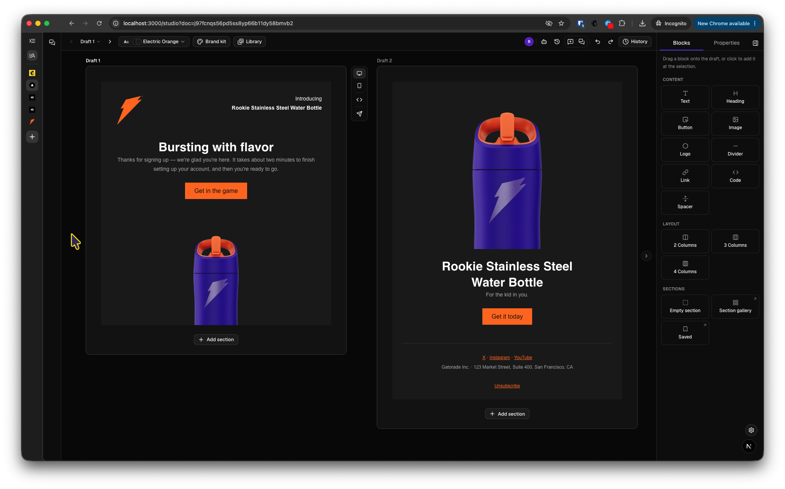
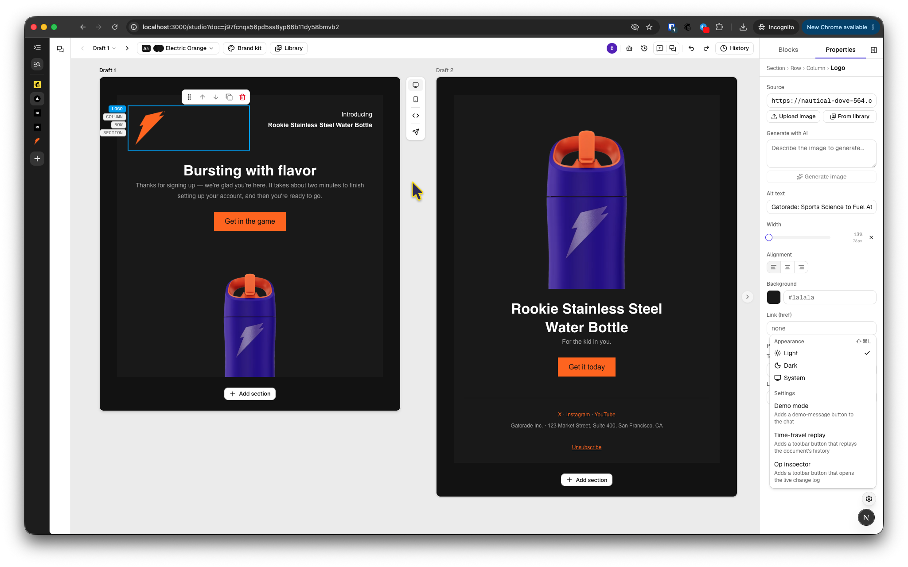

# Flock

| Dark | Light |
|--------|-------|
|  |  |

**What email creation looks like when humans and agents are the same kind of collaborator.**

Flock is a collaborative email studio where you don't just get an AI assistant bolted onto an editor — you get a room. You edit on a live canvas; a copilot builds alongside you from plain language; a crew of advisory agents reads your drafts on a cadence and leaves reviewable recommendations; and other humans (and their agents) can be in the document at the same time, cursors and all. Every change — human click, copilot edit, agent suggestion — flows through the same validated, invertible operations, so you can see who did what, apply anything with one click, and revert anything just as fast.

This is a working preview of a future-facing idea: software where agents are first-class collaborators with visible presence and editable expertise, and the human is always in control.

### 🎥 Demo

[View demo](https://drive.google.com/file/d/1wFisUqoCZpDKZrtSQlJ2VxGkeRBH4PZB/view?usp=drive_link).

## The feature set

| Category | Feature | What it does |
|---|---|---|
| **The Canvas** | Multi-draft canvas | Work on several drafts side by side as frames on one canvas — the active draft is a full live editor, siblings render as live previews. Duplicate a draft to explore a variation, promote one to its own canvas, delete the dead ends, and copy a link that drops a collaborator straight onto any draft or canvas. |
| | Direct manipulation | Drag-and-drop blocks — within the canvas or straight from the palette, where every tile drags — plus floating block toolbars (move, duplicate, delete) and property panels with instant feedback: sliders, color pickers, font dropdowns. |
| | Rich text, block by block | Full rich text inside every text block: per-paragraph alignment, span-level styling — font family, size, color, highlight, links — and a one-click heading preset. Button labels edit right on the canvas. |
| | A full block set | Text, heading, button, image, logo, divider, link, code, and spacer — plus two-, three-, and four-column layouts. New drafts open on a polished starter email. |
| | Section gallery | Eighteen categorized section templates — headers, heroes, feature layouts, product, pricing, testimonials, stats, footers, and more — rendered as live previews in your current theme. Drag one in or click to add; the copilot composes from the same catalog. |
| | Saved sections | Save any section you like and reuse it anywhere. A manager lists your library with usage counts, each saved section carries an AI-written note on when it fits, and the copilot reaches for your sections when composing. |
| | Keyboard-first | ⌘B and ⌘\ toggle the panels, ⌘K jumps to chat, `/` summons a quick prompt from anywhere, `C` flips into comment mode, ⌘⇧L cycles light/dark, and holding `A` turns your cursor into a block stamp. |
| | Comments | Drop a pinned comment on any block (or on the draft as a whole), thread the discussion, and hand one comment — or every open one at once — to the copilot as a fix request. Threads are shared with everyone in the document, and a comment whose block is deleted is flagged rather than silently lost. |
| | Dark mode | Light, Dark, or System — the whole studio follows. |
| | Viewport toggle | Flip any frame between desktop and mobile widths. |
| **The AI Copilot** | Chat that edits the document | Describe what you want; the copilot streams validated edit operations onto the canvas in real time. Invalid tool calls are repaired automatically before they ever touch the document. |
| | Whole emails, streamed in sections | Ask for a full email and it assembles section by section, streaming onto the canvas as each part lands — you watch the email build instead of waiting for it. |
| | Whole new drafts, composed | Ask for a draft *about* something and the copilot adds new drafts beside the one you're on — each a complete header/body/footer email that inherits your theme, with several in one request deliberately varying their shape so exploring is actually exploring. Your current draft is never rebuilt underneath you. |
| | It tells you what it's doing | A turn narrates itself: a thinking state before the first edit lands, then plain-language progress for each step. The wording is always human — a tool the panel hasn't been taught falls back to neutral phrasing rather than leaking an internal name. |
| | AI image generation | Generate images for image blocks from a prompt, with an instant in-canvas preview. Every generation lands in your asset library, ready to browse and reuse. *(Runs against a deterministic stand-in generator on the live deployment — the Gemini image models need a billing-enabled key, and the deployment's is free-tier.)* |
| | Reads the web for you | Point the copilot at a public article and it pulls the content in cleanly — title, byline, date, source, lead image — or at a person's profile page for a spotlight section. Attribution and a link back to the original are built into the workflow, and a page it genuinely cannot read produces a refusal in chat, never invented content. |
| | Canvas-to-chat handoff | Send a selected block or text span straight into the chat composer, queue multiple requests, and recall your prompt history. |
| | It can drive the chrome too | The copilot isn't limited to the document: it can open a named panel or dialog, undo, redo, jump the draft to an earlier version, add drafts, and create an advisory agent — the same things you can do, through the same validated, logged actions. |
| | Suggestions from what you just did | Recolor one button and the copilot notices, then offers to finish the pattern — the section's other buttons, every button in the email, or a re-theme around the new color. Each suggestion is a pre-validated batch: one click applies it, one click reverts it, one click dismisses it for good. |
| **The Agent Crew** | Proactive advisory personas | Four built-in reviewers — **Tone Police**, **Styling Recommender**, **QA Reviewer**, and **Date Checker** — read your drafts on a cadence and surface findings as recommendations, not silent edits. |
| | Visible agent presence | Agents aren't invisible processes. They appear in the header alongside humans, wear pentagon avatars (humans stay circles), and move live cursors across the canvas showing what they're reading, thinking about, and presenting. |
| | Editable expertise | Every persona's behavior is data, not code — open the structured editor and change what an agent cares about. Editing a built-in forks your own copy; the original stays intact. |
| | Agents you write yourself | Create an agent from scratch in the same editor — name it, describe its job, write its behavior. It joins the roster as an equal, and you can delete it again. The copilot can create one for you on request. |
| | You set the pace | Each agent carries its own eagerness slider — from patient to eager — a single pause switch stops the whole crew, and **Check now** triggers a review on demand without waiting for a cooldown. |
| | Reviewable recommendations | Findings arrive in a tray with a badge — apply any suggestion with one click, revert it just as easily, dismiss all at once, and browse each agent's full history in a per-agent modal. Findings persist and converge across tabs. |
| | Ask in chat | When a finding calls for judgment rather than a one-click fix, hand it to the copilot as a ready-made prompt and work it out in conversation. |
| | Affordable to leave on | Each persona watches only the parts of the document it cares about, and lightweight heartbeat checks decide when a change actually warrants a full review — so the crew stays cheap while it stays vigilant. |
| **Multiplayer** | Humans together | Live named cursors, a presence facepile, and per-block collaborative rich text — two people can type in the same paragraph. |
| | Agents in the same room | AI edits merge through the same server-side transform as human keystrokes, so the copilot can restyle a paragraph *while you're typing in it* without clobbering your cursor. |
| | Ghost collaborator | A simulated teammate for solo demos — real presence, real cursor, real typing through the same sync pipeline, so you can see multiplayer without a second person. Turn it on in settings alongside the other demo controls. |
| **History & Trust** | One append-only history | Every mutation from every collaborator lands in a single operation log with authorship — you can always answer "who changed this, and was it a human or an agent?" |
| | Undo, redo, revert | Undo/redo that never rewrites history, plus per-batch revert: unwind any past change — yours, the copilot's, or an agent's — without touching everything after it. |
| | Time travel | Restore the document to any point in time, or scrub through its entire history and watch it replay like a movie. Before/after chips show each change at a glance, in human language. |
| | Op inspector | For the curious: a live console showing every raw operation and its inverse as they happen. Together with replay, it lives behind the settings toggle rather than cluttering the toolbar. |
| **Brand & Theme** | Brand kit from a URL | Type your website address — with or without the `https://` — and Flock extracts your palette (including signature accents), logo, brand name, social card, and social links, and builds a theme from it. |
| | Assets you approve | Extracted logos and images arrive as proposals — nothing joins your kit until you confirm it. Your social links can fill the email footer in one click. |
| | The scrape proposes, you dispose | Rename any color, recategorize it as primary/secondary/accent, add or remove one; pick your heading and body fonts from the email-safe list; edit how the brand sounds — how formal it is, what it talks about itself as, and the words that describe its voice. Re-scraping the site keeps everything you edited by hand instead of overwriting it. |
| | Brand colors everywhere | Your brand palette shows up as swatches inside every color picker in the studio, so on-brand is always one click away. |
| | The copilot writes in your voice | Your saved tone of voice reaches the copilot when it writes email copy — scoped to the copy itself, so the copilot's own replies stay in its normal voice. |
| | Live theming | Pick a theme and every draft follows it live; override any global and snap back cleanly. |
| **Output & Sending** | Email-safe HTML | One click exports email-client-safe HTML — table-based layout, inline styles, unsafe marks trimmed at the renderer — previewable in a sandboxed pane and covered by golden-fixture snapshots. *(Not yet done: an output validator and real Outlook/Gmail/Apple Mail spot checks. The rendered email also has no dark-mode handling yet — the studio's dark mode is the app's chrome, not the email's.)* |
| | Real sending, human-approved | Send yourself a test from the draft's own toolbar or straight from the preview dialog — the recipient defaults to the address you signed in with, and the destination is spelled out in full above the button. Delivered via Resend. The copilot can prepare a send too, but only a human releases it, after an explicit approval step. |
| **Accounts & Access** | Start with one click, keep it with an email | Anyone can start immediately with no account. Add your email and a one-tap sign-in link claims everything you already made — drafts, brand kits, library, your agents — onto a durable identity. Share links are unaffected: the link is the key, and it opens with nothing in front of it. |
| | An allowance, not a wall | Every identity gets a daily allowance of AI work, with a larger one for claimed accounts than for anonymous sessions. Only work *you* asked for spends it — the advisory agents' background sweeps are free, throttled by their own pacing instead. |

### Planned — not built yet

Listed here because they are committed direction, not speculation. Nothing below exists in the app today.

| Feature | What it will do |
|---|---|
| **A home for your work** | Signing in drops you straight into an editor today; there is no page that shows you what you already have. The home page will list your collections of drafts — each with its name, how many drafts are in it, previews of them, and whether it has been sent (and which draft was the one sent) — so prior work is findable instead of link-only. Design brief: `docs/proposals/dashboard-and-collections.md`. |
| **More than one brand** | Managing several brands means several brand kits. The kit is already selectable per collection; what is missing is owning many of them and a place to manage them. |
| **Contacts** | A list of email addresses you own, with paste-a-comma-separated-list bulk entry. Segments and tags are deliberately out of scope for the first version. |

## The primitives (why this works)

Most editors bolt AI on and hope. Flock's core was designed so that humans and agents are the same kind of collaborator — the primitives are not hostile to agents, and everything above falls out of five of them:

- **One append-only operation log with provenance.** Every change from every actor is an operation with an author. There is no second history for AI edits; undo, revert, audit, and time travel all read from the same spine.
- **Pure operations with exact inverses.** Applying an operation never mutates state and always returns its inverse — even cascading deletes invert cleanly. Undo, per-batch revert, and point-in-time restore aren't features that were built; they're consequences.
- **Intent-level actions, validated before anything lands.** Agents don't write raw document JSON. They express intent through a small set of typed actions that are schema-validated, integrity-checked, and translated deterministically — a malformed agent call is repaired or rejected before the document ever sees it.
- **Presence that treats agents as first-class.** Cursors, rooms, and facepiles don't distinguish "user" from "bot" at the infrastructure level — an agent joins a document the way a person does. That's why agent activity is *visible* instead of ambient and spooky.
- **Personas as pure data.** An agent's expertise is a markdown document with a structured shape — readable, editable, forkable, and shareable. Built-ins are just the ones that ship in the box.

The through-line: the human is always in control. Every agent action is a proposal or a logged, attributed, one-click-revertible operation. Nothing is irreversible, and nothing is anonymous.

## Stack

- **Next.js** (App Router, canary) + **React 19**
- **TypeScript 7** (native compiler); the `typescript` package intentionally aliases the TS6 API shim (`@typescript/typescript6`) so API-dependent tooling (ESLint, Vitest, editors) keeps working while `tsc` itself is TS7-native
- **Tailwind 4** + **shadcn/ui**
- **Convex** — data, presence, file storage, and `@convex-dev/prosemirror-sync` for collaborative text
- **Better Auth** (`@convex-dev/better-auth`) — anonymous first touch, magic-link claim; auth tables live inside the component's own namespace
- **AI SDK v7** + **Gemini** (`@ai-sdk/google`)
- **React Email 6** — email-safe HTML rendering
- **Resend** — real email delivery, and the magic-link sender
- **Zod 4**, **pnpm workspaces**

## Repo layout

| Path | What it is |
|---|---|
| `apps/web` | Next.js app — studio canvas, chat panel, personas, presence, API routes |
| `packages/email-sdk` | The core: schemas, flat block store + integrity checks, pure operations with inverses, action envelope/registry, section catalog, renderers |
| `packages/agent` | Agent-side machinery: compressed document views, prompts, intent-level tools (web content fetch, span styling, section scaffolding) |
| `convex/` | Convex functions — documents, op-log history, personas and findings, presence, prosemirror-sync, brand kits, cleanup crons |

## Getting started

```bash
corepack enable            # pnpm is pinned via package.json's packageManager field
pnpm install               # registry pinned to public npm in .npmrc

cp apps/web/.env.example apps/web/.env.local   # fill in values
npx convex dev --once      # provisions dev deployment, writes Convex vars to .env.local

pnpm dev                   # root script (runs apps/web); or run from apps/web
# open http://localhost:3000/studio
```

⚠️ **Some variables do not go in `.env.local`.** Anything read inside `convex/` — the auth secret, the site URL, the credit limits — must be set on the Convex deployment with `npx convex env set NAME value`. A Convex function cannot read `.env.local`, and putting the variable there fails *silently*: the code reads `undefined` and takes its fallback branch. `apps/web/.env.example` marks which is which inline; the full rule is in [Environment variables](#environment-variables-vercel-or-convex-never-both-by-accident) below.

Useful commands:

- `pnpm demo` (in `packages/email-sdk`) — builds an email from ops and emits valid HTML
- `pnpm test` (in `packages/email-sdk`) — Vitest; needs Node >= 20.19
- `pnpm typecheck` / `pnpm lint` / `pnpm build` — run across the workspace from the root (same steps as CI)

**`/api/render` contract:** `POST /api/render` with `{ document }` (a flat block map) returns `{ html }` — email-safe HTML rendered through React Email — or a structured 400 on schema/integrity failures.

## Deployment

- **Vercel** — deployed via CLI with `rootDirectory` set to `apps/web`: https://flockto.email
- **Convex** — separate prod deployment; its URL/deploy key are wired into Vercel env vars

The deployment is **not** invite-only. The shared-password access gate was retired when anonymous entry became a first-class button — a password in front of "continue without an account" is theatre. What protects the API spend now is the per-identity AI credit allowance (`convex/authCredits.ts`), not an access secret. Share links are unchanged: the id in the URL is the capability, and it opens with nothing in front of it. The decision, and the list of what was deleted with the gate, is recorded in `apps/web/src/app/page.tsx`.

### Environment variables: Vercel or Convex, never both by accident

**This is the single most expensive footgun in the repo — it has caused production bugs more than once.** Flock runs on two independently-configured backends, and each reads its *own* environment. Setting a variable in the wrong place fails silently: the code reads `undefined`, takes its fallback branch, and everything looks fine until the behavior is wrong in production only.

The rule is mechanical, so apply it mechanically:

| Where the variable is read | Where it must be set | How |
|---|---|---|
| Anything under `convex/` | The **Convex deployment** | `npx convex env set NAME value` (add `--prod` for production) |
| Anything under `apps/` — routes, server components, client code | **Vercel** (and `.env.local` for local dev) | `vercel env add NAME` or the project dashboard |

Two consequences worth stating out loud:

1. **`.env.local` and Vercel env vars are invisible to Convex functions.** A Convex function cannot read them, at all, ever. `npx convex dev` writes *into* `.env.local`; it does not read configuration back out of it.
2. **A variable read on both sides must be set on both sides.** There are three: `RESEND_API_KEY` and `RESEND_FROM_EMAIL` (Next sends test emails, Convex sends magic links) and `BETTER_AUTH_SECRET` (Convex signs with it; Next reuses it as the salt for the coarsened network key, rather than adding a fourth secret to configure). Same value, two places — forgetting the second one breaks exactly half the feature, which is harder to notice than breaking all of it.

To find out which side a variable belongs to, grep for it: if the hit is in `convex/`, it is a Convex variable. `docs/environment-variables.md` carries the full current inventory with each variable's side and what breaks when it is missing (that file is local-only; `apps/web/.env.example` is the committed short form).

Also note that Convex functions **cannot read cookies**. Anything proven by a cookie — the owner's credit override, for one — is necessarily enforced at the Next.js layer, not inside a Convex function. That is a design constraint, not an oversight.
