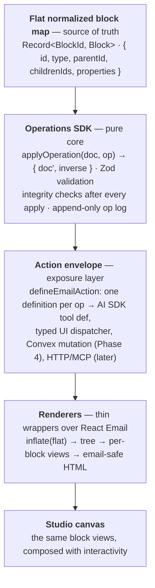

# Tandem

An AI-powered collaborative email editor: natural-language chat on the left, a live rendered email canvas on the right. The user and the AI agent edit the same structured document through one shared operations SDK — nobody authors raw JSON, and every mutation (human click or model tool call) flows through the same validated, invertible operations. **You describe, your partner builds.**

## Architecture at a glance



- **Flat block map.** Blocks keyed by short LLM-addressable ids (`sec_a1b2`, `btn_x9k3`); structure lives in `parentId`/`childrenIds` pointers. The nested tree is derived, ephemeral, render-time only. An integrity checker (orphans, cycles, nesting rules) runs after every mutation.
- **Operations.** 11 pure ops in one Zod discriminated union. `applyOperation(doc, op)` never mutates its input and returns an inverse op for undo — even `removeBlock`'s cascading delete inverts via `restoreBlocks`.
- **Action envelope.** `defineEmailAction` wraps each op with a full validation schema, a compact `agentInputSchema` shown to the model, caller provenance, `kind` (content/editor/analysis), `readOnly`/`parallelSafe` flags, and `needsApproval`. A registry generates every surface from one definition; `dispatchContentAction({...})` threads provenance into the op log and classifies failures as retryable vs terminal.
- **Renderers.** One thin wrapper component per block type mapping resolved styles onto React Email components; style resolution is `DEFAULT_GLOBAL_STYLES ← root.properties.globals ← block overrides`. Output: email-safe HTML (tables, MSO hacks — React Email's job).
- **Rich text.** ProseMirror/Tiptap JSON lives *only* inside text-block `properties.text` (a strict validated subset: headings/paragraphs + bold/italic/underline/strike/link). It never owns structure or block-level styling; per-block sync via `@convex-dev/prosemirror-sync` lands in Phase 5.

Design docs (vision, phased plan, SDK deep-dive, decision records) live in `docs/`, which is gitignored — ask the owner for a copy.

## Stack

- **Next.js** (App Router, canary) + **React 19**
- **TypeScript 7** (native compiler); the `typescript` package intentionally aliases the TS6 API shim (`@typescript/typescript6`) so API-dependent tooling (ESLint, Vitest, editors) keeps working while `tsc` itself is TS7-native
- **Tailwind 4** + **shadcn/ui**
- **Convex** — data, file storage, and (later) `@convex-dev/prosemirror-sync`
- **AI SDK v7** + **Gemini** (`@ai-sdk/google`)
- **React Email 6** + `@react-email/editor` (per-text-block editing surface only)
- **Zod 4**, **pnpm workspaces**

## Repo layout

| Path | What it is |
|---|---|
| `apps/web` | Next.js app — studio canvas, chat panel, API routes (`/`, `/editor`, `/studio`, `/api/render`, `/api/chat` in progress) |
| `packages/email-sdk` | The core package: schemas, flat store + integrity, operations, action envelope/registry, renderers |
| `packages/agent` | Compressed document views, prompts, triage/execute pipeline (Phase 3, in progress) |
| `convex/` | Convex functions — healthcheck, prosemirror-sync config, file storage |

## Getting started

```bash
corepack enable            # pnpm is pinned via package.json's packageManager field
pnpm install               # registry pinned to public npm in .npmrc

cp apps/web/.env.example apps/web/.env.local   # fill in values
npx convex dev --once      # provisions dev deployment, writes Convex vars to .env.local

pnpm dev                   # root script (runs apps/web); or run from apps/web
# open http://localhost:3000/studio
```

Useful commands:

- `pnpm demo` (in `packages/email-sdk`) — builds an email from ops and emits valid HTML
- `pnpm test` (in `packages/email-sdk`) — Vitest; needs Node >= 20.19
- `pnpm typecheck` / `pnpm lint` / `pnpm build` — run across the workspace from the root (same steps as CI)

**`/api/render` contract:** `POST /api/render` with `{ document }` (a flat block map) returns `{ html }` — email-safe HTML rendered through React Email — or a structured 400 on schema/integrity failures.

## Deployment

- **Vercel** — deployed via CLI with `rootDirectory` set to `apps/web`: https://tandem-one-neon.vercel.app
- **Convex** — separate prod deployment; its URL/deploy key are wired into Vercel env vars

## Status

Phased build; each phase ends deployed and demoable.

- **Phase 0 — done.** Scaffold + Vercel/Convex deploy, CI, and three spikes: Resend editor role, prosemirror-sync (incl. AI server-side transforms), AI SDK op streaming.
- **Phase 1 — done.** `email-sdk` complete standalone: schemas, flat store + integrity, pure ops with inverses, action envelope + registry, renderers, `/api/render`.
- **Phase 2 — done.** Studio editor: two-panel shell, interactive canvas reusing the SDK's block views, manual editing through SDK ops.
- **Phase 3 — in progress.** AI agent v1: compressed document views, streamed validated operations, live canvas updates.

Later phases: Convex as source of truth (4), collaborative rich text (5), multiplayer polish (6), advanced agent capabilities (7), sending/QA/evals (8).
