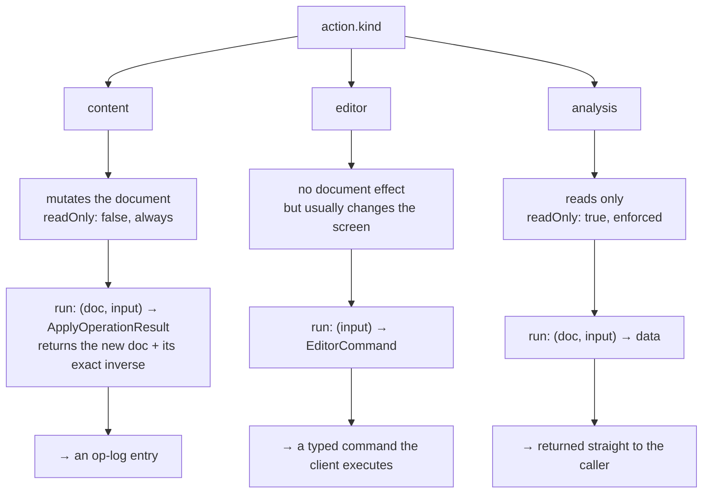
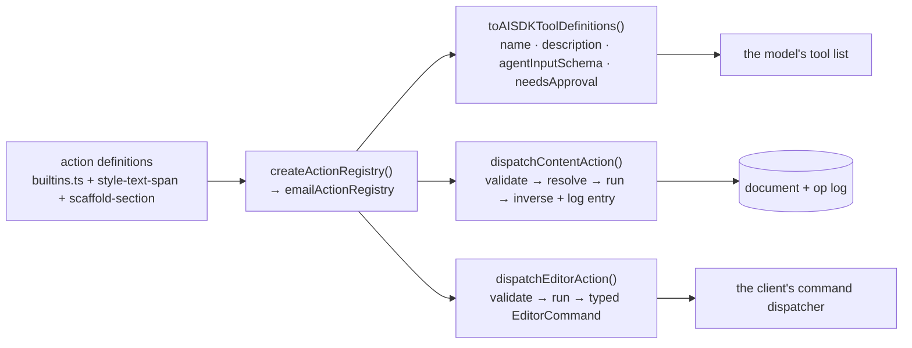
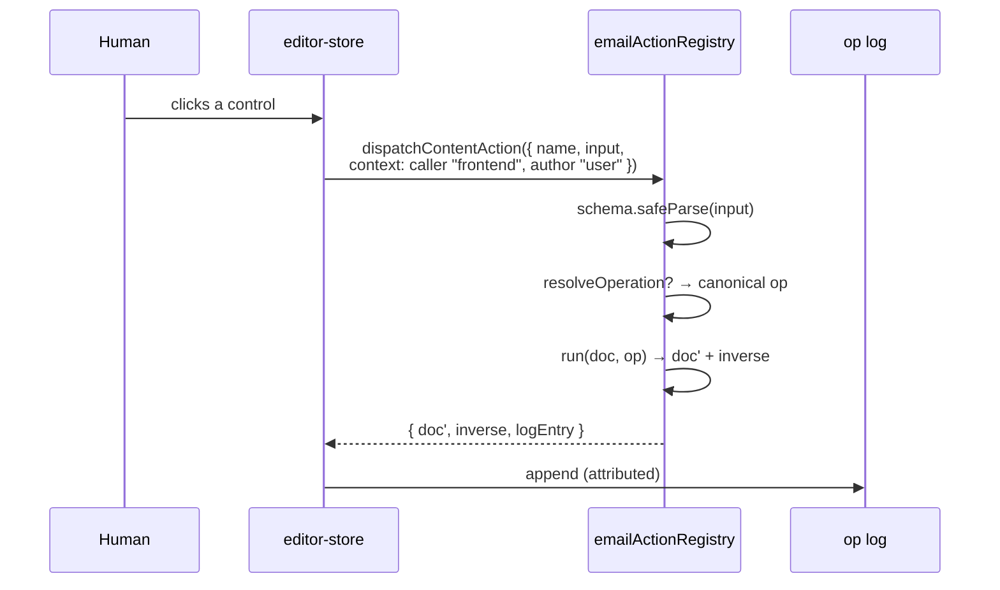
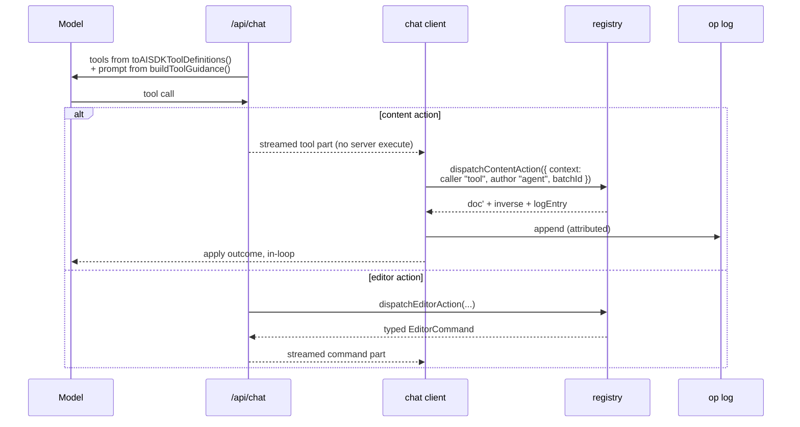

# `@flock/email-sdk` — the actions layer

This package is the core of Flock: the document schema, the flat block store and its integrity checks, the pure operations with exact inverses, the section catalog, the renderers — and the piece this document is about, **the action registry** in [`src/actions/`](src/actions).

The registry is the single description of what can be done to an email. The studio UI dispatches through it. The copilot's tools are generated from it. Its rules — validation, approval, provenance, concurrency — are enforced once, at the only place a change can happen.

For the product-level argument, see the [root README](../../README.md). This document is the mechanics.

## Contents

- [What an action is](#what-an-action-is)
- [Defining one](#defining-one)
- [The three kinds](#the-three-kinds)
- [The registry and its generated surfaces](#the-registry-and-its-generated-surfaces)
- [Two consumers, one registry](#two-consumers-one-registry)
- [`ActionContext` — who is asking](#actioncontext--who-is-asking)
- [`parallelSafe` — what may run at once](#parallelsafe--what-may-run-at-once)
- [`needsApproval` — what a human must release](#needsapproval--what-a-human-must-release)
- [Intent actions and `resolveOperation`](#intent-actions-and-resolveoperation)
- [Failure: retryable vs. terminal](#failure-retryable-vs-terminal)
- [Adding an action](#adding-an-action)
- [What is not here](#what-is-not-here)

## What an action is

An action is one self-describing unit of "a thing that can be done to an email". It is **pure data plus one pure `run` hook**. This module imports no React, no Convex, and not even the `ai` package — that constraint is what lets every other layer consume it without inheriting a runtime.

A definition carries, in one place:

| Field | What it is for |
|---|---|
| `name` | The action name, and the tool name advertised to the model. Lowercase-first, letters/digits/hyphens. |
| `description` | Documentation for a human *and* the model's description of the tool. There is no second copy. |
| `schema` | The full Zod schema. **Every** dispatch validates raw input against this. |
| `agentInputSchema` | An optional compact schema shown to the model instead of `schema`. Defaults to `schema`. |
| `kind` | `content`, `editor`, or `analysis` — see [below](#the-three-kinds). |
| `readOnly` | Whether the action reads without writing. Enforced against `kind`. |
| `parallelSafe` | Whether it may execute concurrently with others in the same turn. |
| `needsApproval` | A boolean, or a predicate over the validated input and the caller. |
| `run` | The pure hook. Never mutates its input. |

## Defining one

`defineEmailAction` ([`define.ts`](src/actions/define.ts)) validates the config and returns it frozen. It is a factory, not a framework:

```ts
export const sendTestEmailAction = defineEmailAction({
  name: "sendTestEmail",
  description:
    "Send a test version of the current email to one recipient for review. Requires human approval before executing.",
  kind: "editor",
  schema: sendTestEmailInputSchema,
  readOnly: false,
  parallelSafe: false,
  needsApproval: true,
  run: (input): SendTestEmailCommand => ({ type: "sendTestEmail", to: input.to }),
});
```

Most content actions are thinner still, because an operation schema already carries its own description and `applyOperation` is already the pure hook. [`builtins.ts`](src/actions/builtins.ts) wraps one per operation:

```ts
export const updateBlockPropertiesAction = defineContentOperationAction({
  name: "updateBlockProperties",
  schema: updateBlockPropertiesOperationSchema,
  parallelSafe: true, /* distinct-block property edits are independent */
});
```

The factory rejects malformed definitions at construction time rather than at call time: an invalid name, an empty description, an unknown kind, a `content` action marked `readOnly`, an `analysis` action that is not, or a missing `run`. Because the registry is built at module scope, these are effectively load-time errors.

## The three kinds

The kinds exist because the three have genuinely different dispatch shapes — not as a taxonomy for its own sake.



**Content** actions are the fifteen that change the email: the thirteen that mirror an operation one-for-one (`updateBlockProperties`, `addBlock`, `removeBlock`, `moveBlock`, `updateText`, `applyTheme`, …) plus the two intent-shaped ones, `styleTextSpan` and `scaffoldSection`. Their `run` returns an `ApplyOperationResult`, which carries the new document *and* the operation that exactly undoes it.

**Editor** actions are the nine that act on the editor rather than the document: `showPreview`, `sendTestEmail`, `generateImage`, `openPanel`, `undo`, `redo`, `goToVersion`, `createDraft`, `createPersona`. Their `run` produces a typed `EditorCommand` ([`editor-commands.ts`](src/actions/editor-commands.ts)) — a value, not an effect. Whoever receives it decides how to execute it.

**Analysis** actions read and return data. None ship in this package; they are layered on in `@flock/agent`, where `getBlockDetails` returns one block's complete JSON plus its ancestor chain so the per-request document outline can stay compact. `readOnly: true` is enforced by the factory, which lets an agent loop dedupe repeated reads within a turn.

Two editor actions are worth calling out because they are *intents*, not effects: `generateImage` and `createPersona` both produce an unfulfilled command. The host app executes the effectful part — a billed model call and a storage upload, or a server-side persona row — and streams back the fulfilled command. The document consequence of a generated image is then one ordinary `updateBlockProperties` operation through the normal path, so image bytes never enter the op log.

## The registry and its generated surfaces

[`registry.ts`](src/actions/registry.ts) is small on purpose: a name-keyed map that throws on duplicates, plus three generated surfaces over it.



A fourth generated surface lives one package over, in `@flock/agent`: `buildToolGuidance(registry)` walks the same registry to write the "Available tools" section of the system prompt, printing each action's own `description` next to its `kind`, `readOnly`, `parallelSafe`, and `needsApproval` flags. The prompt cannot describe a tool the registry lacks, or omit one it has.

That function also gates whole blocks of prompt guidance on registry membership — the section-catalog listing is emitted only while `scaffoldSection` is registered, the web-content workflow only while `fetchWebContent` is, the capability summary only while the UI-parity actions are. A registry never advertises capabilities it does not have.

`emailActionRegistry` — exported from the package root — is the twenty-four built-ins. `@flock/agent`'s `buildAgentActionRegistry()` composes a larger one for the chat route: these twenty-four, plus its analysis actions, plus optional host-injected tools whose executors only the app can provide (SSRF-guarded fetching, image rehosting, search).

## Two consumers, one registry

The registry is consumed by the UI and by the model differently — but through the same functions.





The differences are real but shallow: the model's calls are batched under one `batchId` per turn and never coalesce into a neighbouring edit, and its outcomes are reported back in-loop so it can see what happened. What does *not* differ is the validation, the resolution, the inverse, or the log entry. Both paths call the same function with the same registry.

Note the layering on the model side. The model sees `agentInputSchema`; dispatch re-validates against the full `schema`. Advertising a compact schema is never a relaxation of the gate.

## `ActionContext` — who is asking

[`context.ts`](src/actions/context.ts) defines the provenance every invocation carries:

```ts
export const ACTION_CALLERS = ["tool", "http", "frontend", "cli", "mcp"] as const;
```

`caller` is the surface the call arrived through. `author` is `user` or `agent`. `authorId` identifies the actor; `batchId` groups operations applied atomically (one AI turn is one batch); `threadId` ties an invocation back to its conversation.

This context does two jobs. It is stamped onto the op-log entry, which is what makes history attributable — "who changed this, and was it a human or an agent?" is answerable because provenance is recorded at the choke point rather than reconstructed later. And it is passed to predicate-form `needsApproval`, which is what makes authority expressible as a function of the caller and not only of the input.

Of the five callers, **two are built**: `frontend` (the studio's own dispatcher) and `tool` (the copilot). `http`, `cli`, and `mcp` are reserved vocabulary — the enum and the op-log validators accept them, so a call from one of those surfaces would already be attributable the day the surface is written, but **no HTTP, CLI, or MCP mount exists in this repo**.

## `parallelSafe` — what may run at once

`parallelSafe` declares whether an action can execute concurrently with others inside a single turn. It is a per-action fact with a written rationale, not a guess:

| Rationale | Actions | `parallelSafe` |
|---|---|---|
| Targets exactly one block; distinct-block edits are independent | `updateBlockProperties`, `replaceBlockProperties`, `updateText`, `styleTextSpan` | `true` |
| Contends on the document root's globals | `updateDocumentSettings`, `applyTheme` | `false` |
| Structural — sibling indices shift, or parent/child links are rewired | `addBlock`, `addSection`, `removeBlock`, `moveBlock`, `reorderChildren`, `restoreBlocks`, `placeBlockBeside`, `unplaceBlockBeside`, `scaffoldSection` | `false` |
| Ordering is the semantics, or the call is a slow billed request | every editor action | `false` |

The flag is not only for a scheduler. Because `buildToolGuidance` prints it, the model is *told* which of its tools are sequential — the same fact, from the same field, reaching both the executor and the caller.

## `needsApproval` — what a human must release

Two of the twenty-four built-ins are gated, and the reasoning for each is in the code beside it:

- **`sendTestEmail`** — an email leaves the building. The one irreversible act in the product.
- **`goToVersion`** — a restore rewrites the working document wholesale. It is itself one more history entry and nothing is lost, but it *feels* destructive, and feeling destructive is enough.

When the gate resolves true, the loop halts **before** dispatch. Nothing partial happens. The chat surfaces an approval chip; a human releases it or does not.

The predicate form is the interesting one:

```ts
export type NeedsApprovalOption<TInput> =
  | boolean
  | ((input: TInput, context: ActionContext) => boolean);
```

Because the predicate receives the `ActionContext`, an action can require approval *only when an agent is asking*, or only for particular inputs — external recipients, say. That is the mechanism behind the product's central asymmetry: an agent gets the same capabilities as a human and not the same authority, and this signature is where that is expressible rather than merely intended.

## Intent actions and `resolveOperation`

Some things are natural for a human's UI and unnatural for a model. Selecting a phrase and hitting bold is a gesture; expressing it as a whole replacement rich-text document is a minefield. So a content action may accept **intent** instead of document surgery:

- `styleTextSpan` takes `{ blockId, find, occurrence, style }` — the visible text to find, and what to change about it.
- `scaffoldSection` takes `{ templateId, position, params }` — a catalog template, where to put it, and the copy.

An optional `resolveOperation(doc, input)` hook then translates that intent against the **current** document into one canonical operation, *before* `run` is called. Three properties fall out of doing it there:

1. **`run` receives the resolved operation, not the raw input.** The dispatch contract is uniform across all content actions.
2. **The op log only ever holds replayable operations.** Intent shapes never reach the history spine, so replay, revert, and time travel need to understand exactly one vocabulary.
3. **Resolution failures are structured.** `span_not_found` quotes the block's actual text so the model can copy it verbatim; `unknown_section_template` lists the valid ids. Failures are written as repair hints.

The hook must be pure and deterministic. `removeBlock` uses it for a subtler reason: live removals default `shouldRemoveEmptyAncestors` to true, so emptying a column collapses it and its siblings re-equalize — one operation, one undo step. Resolution writes the flag **explicitly** into the logged operation, so historical entries recorded before the default existed keep replaying exactly as they did.

## Failure: retryable vs. terminal

[`taxonomy.ts`](src/actions/taxonomy.ts) maps every error code to one of two moves, because an agent loop has exactly two:

- **`retryable`** — feed the structured messages back for one repair round. Every message is written to be read by a model. Validation failures, bad ids, out-of-range indices, nesting violations, an unknown action name, a span that could not be found: all correctable by changing the input.
- **`terminal`** — stop the turn and tell the user. Reserved for what the model cannot fix by trying again: `integrity_check_failed` (the operation passed its own checks but the resulting document broke referential integrity — an internal invariant breach) and `wrong_action_kind` (an action routed through the wrong dispatcher — a wiring bug).

`classifyActionErrors` is deliberately pessimistic: if any error in a batch is terminal, the batch is terminal. One invariant breach poisons the whole thing.

The mapping is exported as plain data so the loop's policy can be tuned — demoting a code that proves unproductive to repair — without touching dispatch logic.

## Adding an action

The point of the whole arrangement:

1. Write the definition — a Zod schema, a description, the flags, a pure `run`.
2. Add it to the array in [`builtins.ts`](src/actions/builtins.ts).

That is the whole procedure. Registration order is preserved and deterministic, which matters because `buildToolGuidance` output is part of a cached prompt prefix — so append rather than reorder unless you mean to.

What happens without further work:

- The model is offered a new tool, with your description, under your schema.
- The system prompt's tool listing gains a line, with the flags derived from the definition.
- `dispatchContentAction` / `dispatchEditorAction` will validate, run, and log it.
- The UI can dispatch it through the identical call it already makes for every other action.
- Its approval gate is honoured on every path, because the gate is resolved inside dispatch and not at any call site.
- Its provenance is recorded, because `ActionContext` is a required dispatch argument.

There is no tool-definitions file to update, no prompt paragraph to write, no second schema to keep in sync, and no separate approval check to remember. If a future HTTP, CLI, or MCP mount is written, it inherits actions added today for the same reason the existing two consumers do — none of them enumerate actions, they all walk the registry.

The honest caveats: an *editor* action's typed command still needs a client-side executor, since a command is a value and something has to run it; and a genuinely new capability may still deserve its own UI affordance. What the registry removes is the drift, not the work.

## What is not here

Deliberately absent, and each absence load-bearing:

- **Persistence.** `dispatchContentAction` returns a ready-to-persist log entry; writing it is Convex's job.
- **The agent loop.** Approval halting, repair rounds, and streaming live in the app.
- **Provider glue.** `toAISDKToolDefinitions` emits plain objects and Zod schemas. Converting them into a specific model's declaration format is the app's problem — including the Gemini-compatibility rewriting in `apps/web/src/app/api/chat/model-schema.ts`, which changes only the declaration and leaves the original Zod schema as the validating authority.
- **`clearContent`.** [`clear-content.ts`](src/actions/clear-content.ts) sits in this directory but is *not* a registered action. It is a pure planner: given a document, it returns the ordinary operations that strip the words and pictures while leaving layout, theme, styling, and the brand logo standing. The caller applies them through the normal dispatch path, so a clear lands in version history and reverts like any other edit. It needs no registry entry to get those properties — which is the strongest available evidence that the operation layer underneath is sound on its own.

## Tests

```bash
pnpm test        # vitest, needs Node >= 20.19
pnpm demo        # builds an email from ops and emits valid HTML
pnpm typecheck
pnpm lint
```

Each actions module has a co-located `*.test.ts`. [`registry.test.ts`](src/actions/registry.test.ts) covers dispatch, validation layering, and the failure taxonomy.

[`row-property-parity.test.ts`](src/actions/row-property-parity.test.ts) is worth reading as a statement of intent: it dispatches a row's style properties *with an agent `ActionContext`* through the same `updateBlockProperties` action the human's panel writes through, and pins the three things a new control has to do to be real — survive schema validation, produce an inverse that restores the previous state, and resolve into the styles the renderer actually reads. The parity claim in the root README is a test in this package, not an aspiration.
